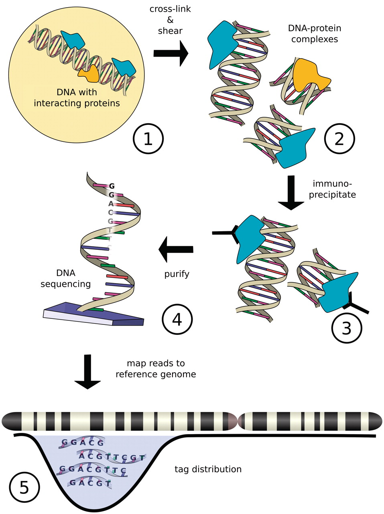
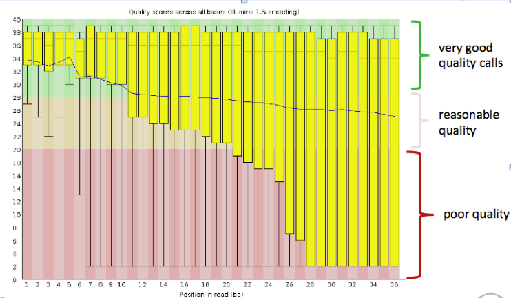
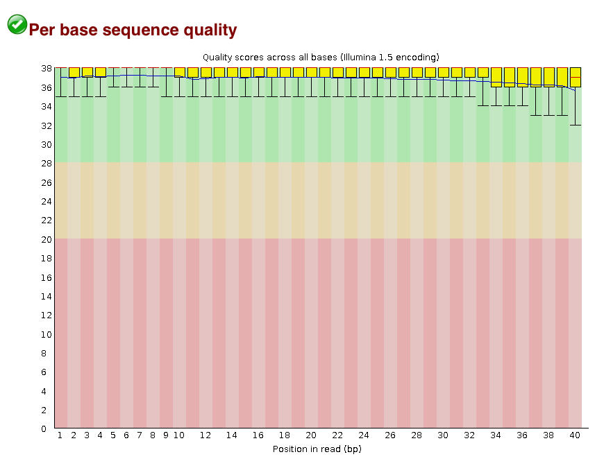
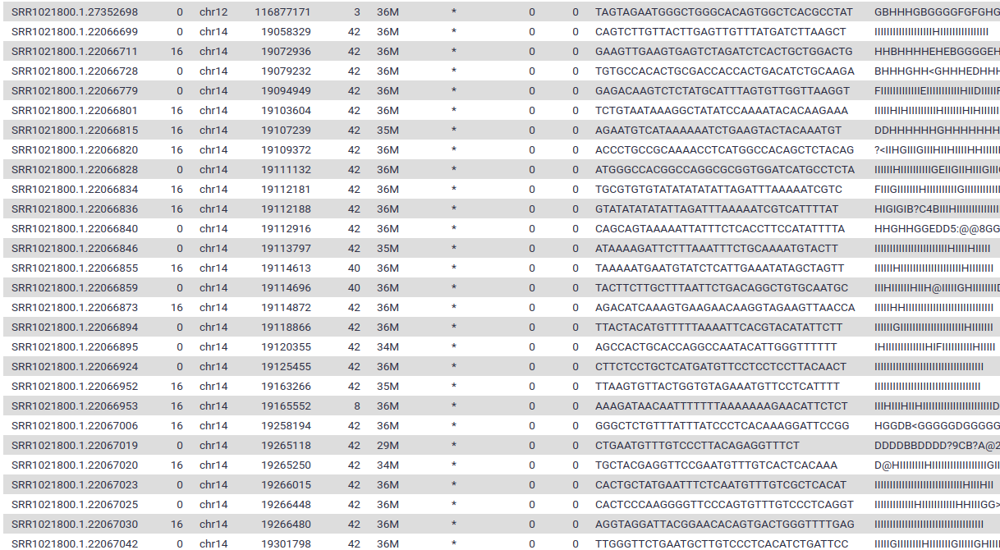
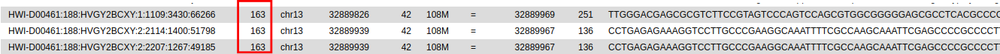
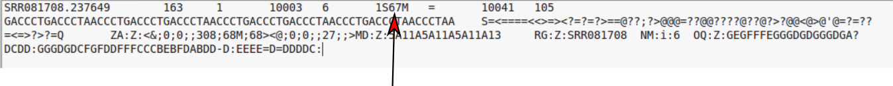
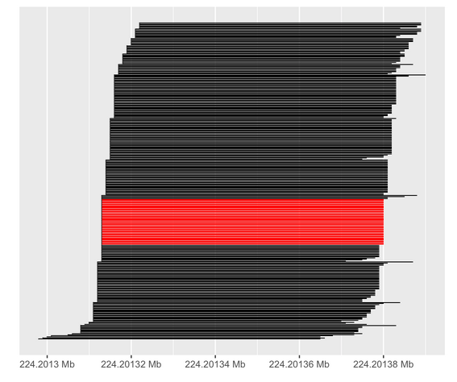
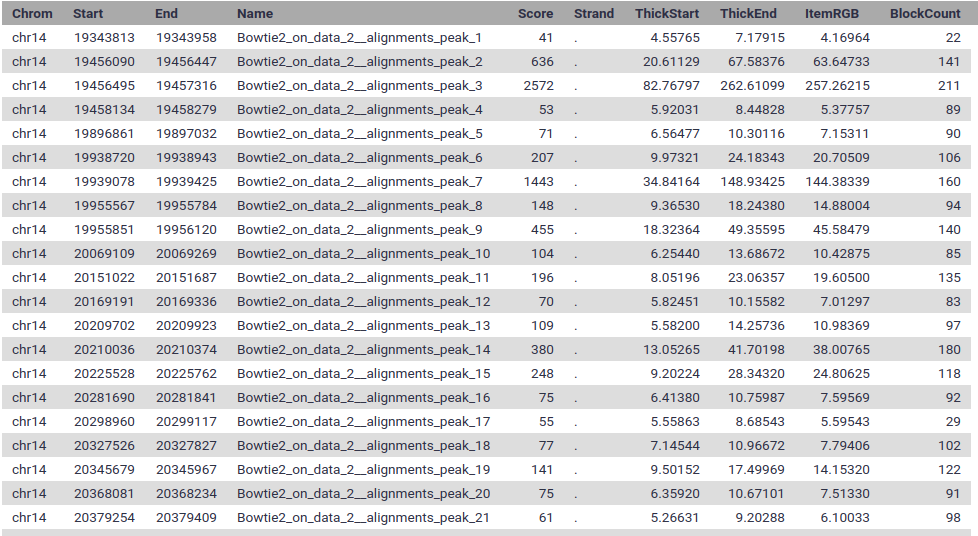
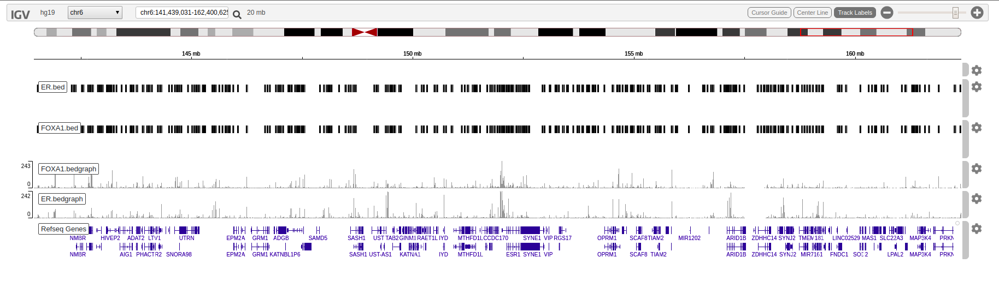

```{r setup, include=FALSE}
knitr::opts_chunk$set(echo = TRUE,message=FALSE,eval=FALSE)
```
# Hands-on chip-seq Analysis in Galaxy and R

### Sheffield Bioinformatics Core


web : [sbc.shef.ac.uk](http://sbc.shef.ac.uk)  
twitter: [SheffBioinfCore](https://twitter.com/SheffBioinfCore)  
email: [bioinformatics-core@sheffield.ac.uk](bioinformatics-core@sheffield.ac.uk)

-----

# Acknowledgement

Some of these materials are based on courses available at .

- [ATAC-Seq data analysis in Galaxy](https://training.galaxyproject.org/training-material/topics/epigenetics/tutorials/atac-seq/tutorial.html/)
- [Chip-seq excersizes in R by Jonas Ibn-Salem, JGU Mainz](http://cbdm-01.zdv.uni-mainz.de/~jibnsale/teaching/chip-seq_exercises.html)

-----

# Tutorial overview
This tutorial will cover the basics of processing a chip-seq analysis using Galaxy; a open-source web-based platform for the analysis of biological data. You should gain an appreciation of the tasks involved in a typical NGS analysis and be comfortable with the outputs generated by a sequencing service.

We will also include the commands to achieve the same results from the terminal. If you are not interested in seeing these commands. This code can be hidden / displayed as required by clicking the *Code* buttons.

This morning tutorial covers the following steps in our analysis pipeline


## Introduction to chip-seq

Chromatin immunoprecipitation sequencing (ChIP-seq), is a technique for analysing protein interactions with DNA. Following ChIP protocols, DNA-bound protein is immunoprecipitated using a specific antibody. The bound DNA is then coprecipitated, purified, and sequenced.



## The data

The data for this tutorial is from a publicly-available breast cancer study showing how ER-chromatin interactions and endocrine response in breast cancer are dependent on Forkhead protein (FOXA1)

https://www.ncbi.nlm.nih.gov/pmc/articles/PMC3024537/

-----

# Section 1: Preparation


**Ignore if you have already created a Galaxy account and uploaded the example data in a previous exercise**

#### 1.  Register as a new user on one of the public Galaxy servers

- https://usegalaxy.org
- https://usegalaxy.org.au
- https://usegalaxy.eu

**Make sure you check your email to activate your account**

#### 2.  Import the data for the workshop.

We can going to import the [*fastq* files](https://en.wikipedia.org/wiki/FASTQ_format) for this experiment. This is a standard format for storing raw sequencing reads and their associated quality scores. However, as we will see, the representation of the quality scores has changed over time.

You can import the data by:

1.  In the tool panel located on the left, under Basic Tools select **Get
    Data > Upload File**. Click on the **Paste/Fetch data** button on the
    bottom section of the pop-up window.
2.  Upload the sequence data by selecting the files `MCF7_ER.fastq`, `MCF7_FOXA1.fastq` and `MCF7_input.fastq`. You don't need to specify the file type or genome build. Galaxy should be able to make a reasonable guess.


3.  You should now have these 4 files in your history:
    - `MCF7_ER.fastq`
    - `MCF7_FOXA1.fastq`
    - `MCF7_ER_input.fastq`
    - `MCF7_FOXA1_input.fastq`
    

## Running the practical at the command line

### On a personal laptop or desktop


### On the University of Sheffield HPC (sharc)

The tools required for this practical have been made available on sharc. Please follow these instructions to setup
```{bash eval=FALSE}
ssh USERNAME@sharc.shef.ac.uk
## launch an interactive shell with 6G of RAM
qrshx -l rmem=6G
## create a directory you want to work in and change to that directory
mkdir <working_dir>
cd <working_dir>
## Create a link to where the tools are available
export IMAGE_BASE="singularity exec /usr/local/community/bioinformatics-core/singularity/chipseq-training"
```

The example data can be downloaded from the course github repository as follows

```{bash eval=FALSE}
### Download the example data by pasting these commands into the terminal

wget https://raw.githubusercontent.com/evchambers/chip-seq-training-course/master/data/MCF7_FOXA1_input.fastq
wget https://raw.githubusercontent.com/evchambers/chip-seq-training-course/master/data/MCF7_ER_1.fastq
wget https://raw.githubusercontent.com/evchambers/chip-seq-training-course/master/data/MCF7_FOXA1_1.fastq
## print start of MCF7_input.fastq
head MCF7_FOXA1_1.fastq -n16
```

# Section 2: Fastq file format

You can view the files you just uploaded by clicking the **eye icon** the history item. The first few lines should read as follows


**MCF7_input.fastq**

```
@SRR1021804.1.17519002
CCTGTGTTCCTTCTAAGCTCAGTCACTGGAAAACA
+
HHHGHHHHHHHHHHHHHHHHGHHHHHHHHHHHHHH
@SRR1021804.1.17519003
ATCCTCCCAATATTTTATATGTATATTTTTTACCAA
+
DGGEGEDDGGGDGGFHGHAHBGGGEFFDCCDAGDED
@SRR1021804.1.17519004
TTTCTTTTAATTTCAGTGAAATCACTTGGGCTTTGT
+
IIIHIIIIIIIIIIHIIHIIIIIIIIIFIIEIIHHI
```


The first line is the unique identifier for each sequenced read. It can be used to encode information such as the *sequencing machine*, *flow cell* and *lane* that the read was generated from and the physical coordinates on the lane.  

The quality scores are [ASCII](http://ascii-code.com/) representations of how confident we are that a particular base has been called correctly. Letters that are further along the alphabet indicate higher confidence. This is important when trying to identify types of genome variation such as single base changes, but is also indicative of the overall quality of the sequencing. Different scales have been employed over time (resulting in a different set of characters appearing in the file). 

If you are interested in deriving the quality scores for each base then there is more information [here](https://en.wikipedia.org/wiki/FASTQ_format) However, in practice, we don't have to convert the values as we have software that will do this automatically

-----

# Section 3: Quality assessment

[FastQC](https://www.bioinformatics.babraham.ac.uk/projects/fastqc/) is a popular tool from [Babraham Institute Bioinformatics Group](https://www.bioinformatics.babraham.ac.uk/index.html) used for *quality assessment* of sequencing data. Most Bioinformatics pipelines will use FastQC, or similar tools in the first stage of the analysis. The [documentation](https://www.bioinformatics.babraham.ac.uk/projects/fastqc/Help/) for FastQC will help you to interpret the plots and stats produced by the tool. A traffic light system is used to alert the user's attention to possible issues. 

- From the left hand tool panel in Galaxy, under *GENOMIC FILE MANIPULATION*, select *FASTQ Quality Control -> FastQC*
- Select one of the FASTQ files as input and *Execute* the tool.
- When the tool finishes running, you should have an HTML file in your History. Click on the eye icon to view the various quality metrics.

### Command line

```{bash}
#help for fastqc
$IMAGE_BASE fastqc -h

## Make a directory for the qc results
mkdir qc
#commands to run fastqc on our fastq files
$IMAGE_BASE fastqc MCF7_FOXA1.fastq -o qc
$IMAGE_BASE fastqc MCF7_ER.fastq -o qc
$IMAGE_BASE fastqc MCF7_input.fastq -o qc
```


The most important image is whether the base quality decreases significantly over the length of the read



Good quality data should look something like:-




Look at the generated FastQC metrics for your uploaded fastq files. This data looks pretty good - high per-base quality scores (most above 30).

All is not lost if we observe poor quality bases towards the end of the read. There are a number of *trimming* options that we can use for NGS data and some of these are available through Galaxy. Check out the [Trimmming Reads](https://galaxyproject.org/tutorials/ngs/#trimming-reads) section of the Galaxy NGS tutorial if you are interested in how we can trim our reads.

It is also worth bearing in mind that the tool is blind to the particular type of sequencing you are performing (i.e. whole-genome, ChIP-seq, RNA-seq) and the organism being sequenced, so some warnings might be expected due to the nature of your experiment. For instance, there are known sequencing composition biases that can occur at the beginning of RNA-seq reads. 

## Aggregating QC reports with multiqc

For datasets with large numbers of fastq files, it may be useful to aggregate the individual reports into a single combined report. 

- Under *GENOMIC FILE MANIPULATION*, select *FASTQ Quality Control -> MultiQC*
- Make sure *Software name* is set to `FastQC`
- In *Results file*, select the **RawData** results files that you have just generated

You should then be able to view the fastqc plots for both the fastq files on the same page.

### Command line

```{bash}
$IMAGE_BASE multiqc qc
```

# Section 4: Trimming

Based on these quality plots we may want to trim our data. Trimming removes poor quality bases that tend to occur at the end of each read. It can also remove any unwanted adapter or primer sequences left over from sequencing. Popular choices are fastx_toolit, trimmomatic and cutadapt. In this instance we are going to use cutadapt

- Under *FASTA/FASTQ*, select *cutadapt*


### Command line

```{bash}
$IMAGE_BASE cutadapt file.fastq
```


# Section 5: Alignment

We don't really spend much time look at *fastq* files, as most of our time is spent with *aligned* reads. i.e. we have used some software to tell us whereabouts in the genome each read belongs to. This will *usually* be performed for you as part of a sequencing service, but it is good to get an appreciation of the steps involved.

In this section we map the reads in our FASTQ files to a reference genome. 

A plethora of different tools have been written to perform this task, and we will not describe it in detail. Links to some key publications are given below:-

  + 2009 Bowtie 1 - [Langmead et al](http://genomebiology.com/content/10/3/R25)
  + 2012 Bowtie 2 - [Langmead and Salzberg](http://www.nature.com/nmeth/journal/v9/n4/full/nmeth.1923.htm)
  + 2009 BWA - [Li and Durbin](http://bioinformatics.oxfordjournals.org/content/25/14/1754.long)
  + 2010 BWA - [Li and Durbin](http://bioinformatics.oxfordjournals.org/content/26/5/589)
  + 2013 BWA-MEM - [Li](http://arxiv.org/abs/1303.3997)

Alignment relies on the reference genome being *indexed* so that the sequencing reads can be located more efficiently. The genome index is a highly-accessible data structure, and Galaxy includes indices for many popular genomes. 

```{bash}
@PG ID:bowtie2 PN:bowtie2 VN:2.3.4.1 CL:"/jetstream/scratch0/main/conda/envs/mulled-v1-65d5efe4f1b69ab7166d1a5a5616adebe902133ea3e4c189d87d7de2e21ddc17/bin/bowtie2-align-s --wrapper basic-0 -p 10 -x /cvmfs/data.galaxyproject.org/byhand/hg19/hg19full/bowtie2_index/hg19full -1 input_f.fastq -2 input_r.fastq"

```


#### 1.Align the example files  

- Find the tool *NGS: Mapping* -> *Bowtie2*
  + alternatively, type `bowtie` in the search box
- In *Is this single-end or Paired-end?* Select **Single-end**
- Set *FastQ file #1* and *FastQ file #2* to the two fastq files you uploaded in the previous step
- Make sure the reference genome is set to **Human (Homo sapiens)(b37):hg18: **
- Press *Execute*
- Wait!

The result will be a `.bam` file that we will describe in the next section. This file is not human-readable, as it is compressed. But we can convert to a readable format for illustration purposes.

### Command line

```{bash}

## retrieve pre-computed bowtie2 index. To see how to build an index from scratch, see next chunk

wget ftp://ftp.ccb.jhu.edu/pub/data/bowtie2_indexes/hg19.zip
unzip hg19.zip

## alignment with bowtie2
$IMAGE_BASE bowtie2 -x hg19 MCF7_FOXA1_1.fastq -S MCF7_FOXA1_1.sam
$IMAGE_BASE bowtie2 -x hg19 MCF7_FOXA1_input.fastq -S MCF7_input.sam
```

```{bash}
## convert the sam into a bam file

$IMAGE_BASE samtools view -bS MCF7_FOXA1_1.sam > MCF7_FOXA1_1.bam
$IMAGE_BASE samtools view -bS MCF7_INPUT.sam > MCF7_INPUT.bam

## Arrange alignments according to genome
$IMAGE_BASE samtools sort MCF7_FOXA1_1.bam -o MCF7_FOXA1.sorted.bam

$IMAGE_BASE samtools sort MCF7_INPUT.bam -o MCF7_INPUT.sorted.bam

## Produce an index file
$IMAGE_BASE samtools index MCF7_FOXA1.sorted.bam
$IMAGE_BASE samtools index MCF7_INPUT.sorted.bam

## Print the first few alignments in the file
$IMAGE_BASE samtools view -h MCF7_FOXA1.sorted.bam | head
```


```{bash}
## OPTIONAL: 
## Instructions for building an index
## download hg19 fasta from UCSC

wget http://hgdownload.cse.ucsc.edu/goldenPath/hg19/bigZips/hg19.fa.gz
## index with bowtie2
$IMAGE_BASE bowtie2-build hg19.fa.gz hg19

```
#### 2. View the alignments

1.  Click on the eye of the resulting file to view the alignments.




### About the `bam` file format

Unlike most of Bioinformatics, a *single standard* file format has emerged for aligned reads. Moreover, this file format is consistent regardless of whether you have DNA-seq, RNA-seq, ChIP-seq... data. 

The `bam` file is a compressed, binary, version of a `sam` file.

### The `.sam` file

- **S**equence **A**lignment/**M**ap (sam) 
- The output from an aligner such as `bwa`
- Same format regardless of sequencing protocol (i.e. RNA-seq, ChIP-seq, DNA-seq etc)
- May contain un-mapped reads
- Potentially large size on disk; ~100s of Gb
    + Can be manipulated with standard unix tools; e.g. *cat*, *head*, *grep*, *more*, *less*....
- Official specification can be [obtained online](http://samtools.github.io/hts-specs/SAMv1.pdf): -
- We normally work on a compressed version called a `.bam` file. See later.
- *Header* lines starting with an `@` character, followed by tab-delimited lines
    + Header gives information about the alignment and references sequences used


The first part of the header lists the names (`SN`) of the sequences (chromosomes) used in alignment, their length (`LN`) and a *md5sum* "[digital fingerprint](https://en.wikipedia.org/wiki/Md5sum)" of the `.fasta` file used for alignment (`M5`).

```

@HD VN:1.0 SO:coordinate
@SQ SN:chr10 LN:135534747
@SQ SN:chr11 LN:135006516
@SQ SN:chr11_gl000202_random LN:40103
@SQ SN:chr12 LN:133851895
@SQ SN:chr13 LN:115169878
@SQ SN:chr14 LN:107349540
@SQ SN:chr15 LN:102531392
@SQ SN:chr16 LN:90354753
.....
.....

```


Next is a *tab-delimited* section that describes the alignment of each sequence in detail. 

```
HWI-D00461:188:HVGY2BCXY:1:1109:3430:66266	163	13	32889826	42	108M	=	32889969	251	TTGGGACGAGCGCGTCTTCCGTAGTCCCAGTCCAGCGTGGCGGGGGAGCGCCTCACGCCCCGGGTCGCTGCCGCGGCTTCTTGCCCTTTTGTCTCTGCCAACCCCCAC	0D@@?GEHCHHCEHIDHH?1CCHCHI@1<CCCFC@GCCCEHIHCHICHC?HH=GHE1DE<CEHDEHHC<CCH/?HHG/<1<D@11D?G?FGHEHH01D00D;00<DH<	AS:i:-5 XN:i:0 XM:i:1 XO:i:0 XG:i:0 NM:i:1 MD:Z:21C86 YS:i:-5 YT:Z:CP

```


Column | Official Name | Brief
------ | -------------- | -----------
1      | QNAME          | Sequence ID
2      | FLAG           | Sequence quality expressed as a bitwise flag
3      | RNAME          | Chromosome
4      | POS            | Start Position
5      | MAPQ           | Mapping Quality
6      | CIGAR          | Describes positions of matches, insertions, deletions w.r.t reference
7      | RNEXT          | Ref. name of mate / next read
8      | PNEXT          | Position of mate / next read
9      | TLEN           | Observed Template length
10     | SEQ            | Sequence
11     | QUAL           | Base Qualities

There can also be all manner of optional tags as extra columns introduce by an aligner or downstream analysis tool. A common use is the `RG` tag which refers back to the read groups in the header.


### Sorting and indexing

You will notice from the 3rd column that the reads are ordered according to their start position; whereas the reads in the `fastq` file were arranged in order that they were generated on the flow cell. By default, `bowtie2` produces a bam where the reads are in the same order as the `fastq`. However, this is rather inconvenient for analysis where we require reads from the same location to be next to each other in the file.

An additional couple of steps have been performed after bowtie2; sorting the file according to genome position and producing an *index* file. The index file does not provide any useful information for us and cannot be viewed in Galaxy. However, we will need it later on when viewing the data in IGV. 

### Fun with flags!

The *"flags"* in the sam file can represent useful QC information

  + Read is unmapped
  + Read is paired / unpaired
  + Read failed QC
  + Read is a PCR duplicate (see later)

The combination of any of these properties is used to derive a numeric value


For instance, a particular read has a flag of 163




### Derivation

There is a set of properties that a read can possess. If a particular property is observed, a corresponding power of 2 is added multiplied by 1. The final value is derived by summing all the powers of 2.


Flag Value | Meaning
---------- | --------------------------------
69 (= 1 + 4 + 64) 	| The read is paired, is the first read in the pair, and is unmapped.
77 (= 1 + 4 + 8 + 64) |	The read is paired, is the first read in the pair, both are unmapped.
83 (= 1 + 2 + 16 + 64) |	The read is paired, mapped in a proper pair, is the first read in the pair, and it is mapped to the reverse strand.
99 (= 1 + 2 + 32 + 64) |	The read is paired, mapped in a proper pair, is the first read in the pair, and its mate is mapped to the reverse strand.
133 (= 1 + 4 + 128) |	The read is paired, is the second read in the pair, and it is unmapped.
137 (= 1 + 8 + 128)  |	The read is paired, is the second read in the pair, and it is mapped while its mate is not.
141 (= 1 + 4 + 8 + 128) |	The read is paired, is the second read in the pair, but both are unmapped.
147 (= 1 + 2 + 16 + 128) |	The read is paired, mapped in a proper pair, is the second read in the pair, and mapped to the reverse strand.
163 (= 1 + 2 + 32 + 128) |	The read is paired, mapped in a proper pair, is the second read in the pair, and its mate is mapped to the reverse strand.


See also

- https://broadinstitute.github.io/picard/explain-flags.html

### Have a CIGAR!




The ***CIGAR*** (**C**ompact **I**diosyncratic **G**apped **Alignment** **R**eport) string is a way of encoding the match between a given sequence and the position it has been assigned in the genome. It is comprised by a series of letters and numbers to indicate how many consecutive bases have that mapping.


 
 Code  | Description
------------- | -------------
M  | alignment match
I  | insertion
D  | deletion
N  | skipped
S  | soft-clipping
H  | hard-clipping


e.g.

- `68M`
    + 68 bases matching the reference
- `1S67M`
    + 1 soft-clipped read followed by 67 matches
- `15M87N70M90N16M`
    + 15 matches following by 87 bases skipped followed by 70 matches etc.


#### 3. Post-processing

###  Duplicates

The preparation of a sequencing library requires *PCR* amplification of your starting material. This can lead to some DNA fragments being over-represented in your data. As our DNA fragments are formed in a random process, and relatively small compared to the number of bases to be sequenced from the genome (3Gb in humans), we tend to think the two DNA fragments that have identical starting and ending position are unlikely to have occurred due to chance. Some software, such as [Picard](http://broadinstitute.github.io/picard/) will identify such artefacts and *mark* them for attention by downstream methods. i.e. they are not completely discarded from the analysis.



#### Duplicates with Picard

1. Use the tool *NGS: Picard -> MarkDuplicates*
2. In *Select SAM/BAM dataset or dataset collection* choose the bam file produced by bowtie2.
3. What do you notice about the *flag* values for any reads that have the same *start* as another read? 
4. Interpret the meaning of these flags using the online tool
  + https://broadinstitute.github.io/picard/explain-flags.html

**Warning** the assumption about reads having the same start location being PCR duplicates falls down when we do sequencing for a very specific region of the genome. e.g. targeted sequencing from a panel of cancer genes. Running a tool to mark PCR duplicates on such data would recommend a high proportion of reads be ignored from further analysis.
  
```{bash}
## make link to our version of picard
export PICARD=/usr/local/community/bioinformatics-core/picard.jar
## load the java shared module on sharc
module load apps/java

## command to mark duplicates
java -jar $PICARD MarkDuplicates INPUT=MCF7_FOXA1.sorted.bam OUTPUT=MCF7_FOXA1.sorted_pcrdups.bam  ASSUME_SORTED=true METRICS_FILE=MCF7_FOXA1_dups_metrics.txt VALIDATION_STRINGENCY=SILENT 

## index the resulting file
$IMAGE_BASE samtools index MCF7_FOXA1.sorted_pcrdups.bam
```
  

# Section 6: Peak Calling

To call peaks we will use MACS2. 

1. Select MACS2 *NGS: Peak calling → MACS2 callpeak* 
2. In ChIP-seq treatment file, select the treatment bam files (the ones with marked duplicates) 
3. In ChIP-seq control file, select the input bam files
4. In Effective genome size, select *H.sapiens(2.7e9)*
5. In additional outputs check the *Scores in bedGraph files (--bdg)* box
6. Execute!

### Inspecting peaks
Peaks BED File

The default output is the narrowPeak BED file (BED6+4 format). This contains the peak locations, together with peak summit, pvalue and qvalue. You can load it to UCSC genome browser.



1. Chromosome name
2. Start position of peak
3. End position of peak
4. Name of peak
5. Integer score for display in genome browser (e.g. UCSC)
6. Strand, either "." (=no strand) or "+" or "-"
7. Fold-change
8. -log10pvalue
9. -log10qvalue
10. Relative summit position to peak start

Download the NarrowPeaks files by clicking on the save icon. Save the files as MCF7_ER.bed, MCF7_FOXA1.bed.
Download the treatment Bedgraph files by clicking on the save icon. Save the files as MCF7_ER.bedgraph and MCF7_FOXA1.bedgraph

### Command line

```{bash}

## standard MACS2 run
$IMAGE_BASE macs2 callpeak -t MCF7_FOXA1.sorted.bam -c MCF7_INPUT.sorted.bam -g hs -f BAM --bdg
## see the help for other options
$IMAGE_BASE macs2 callpeak -h

```

# Section 7: Visualising Peaks (IGV viewer)
Whilst tools like R are very powerful and allow you to perform statistical analyses and test hypotheses, there is no substitute for ***looking at the data***. A trained-eye can quite quickly get a sense of the data quality before any computational analyses have been run. Futhermore, as the person requesting the sequencing, you probably know a lot about the biological context of the samples and what to expect. 

- IGV has been developed by the Broad Institute and is able to display most kinds of genomic data
    + expression
    + ChIP
    + whole-genome resequencing
    + shRNA
    
- It is a *Java* desktop application and can be run either locally of from the Broad website
- To run IGV yourself you will need to agree to the license and [download the version for your OS](http://www.broadinstitute.org/software/igv/download)

If you have problems running IGV, you can use the online app https://igv.org/app/.

Upload the tracks we downloaded from MACS2.


